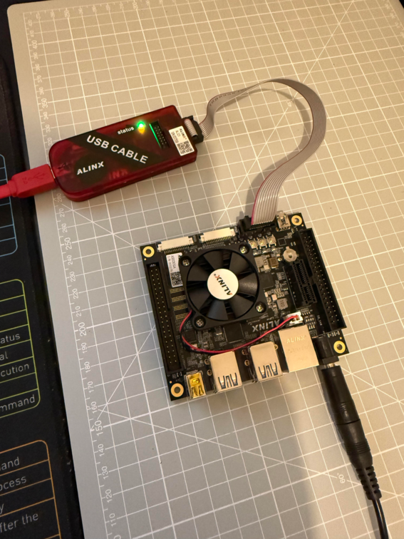

# VHDL Projects Workspace

This workspace contains multiple VHDL-based projects, each focusing on different aspects of digital design and FPGA development. Below is an overview of the projects:

## Projects Overview

### 1. **FIFO Test**
- **Description**: Implements and tests a First-In-First-Out (FIFO) memory structure.
- **Key Components**:
  - `fifo_test.xpr`: Project file.
  - `fifo_test.srcs/`: Contains source files, constraints, and simulation files.
  - `fifo_test.runs/`: Includes synthesis and implementation runs.
  - `fifo_test.sim/`: Simulation files.

### 2. **ILA Example**
- **Description**: Demonstrates the use of Integrated Logic Analyzer (ILA) for debugging.
- **Key Components**:
  - `ila_0_ex.xpr`: Project file.
  - `ila_0_ex.srcs/`: Source files for the ILA example.
  - `ila_0_ex.sim/`: Simulation files.
  - `imports/`: Example files for ILA usage.

### 3. **Key Test**
- **Description**: Tests key input functionality.
- **Key Components**:
  - `key_test.xpr`: Project file.
  - `key_test.srcs/`: Source files and constraints.
  - `key_test.runs/`: Synthesis and implementation runs.

### 4. **LED Control**
- **Description**: Implements LED control logic.
- **Key Components**:
  - `led.xpr`: Project file.
  - `led.srcs/`: Source files for LED control.
  - `led.runs/`: Synthesis and implementation runs.

### 5. **PLL Test**
- **Description**: Tests Phase-Locked Loop (PLL) functionality.
- **Key Components**:
  - `pll_test.xpr`: Project file.
  - `pll_test.srcs/`: Source files.
  - `pll_test.runs/`: Synthesis and implementation runs.

### 6. **PWM Test**
- **Description**: Implements and tests Pulse Width Modulation (PWM).
- **Key Components**:
  - `pwm_test.xpr`: Project file.
  - `pwm_test.srcs/`: Source files.
  - `pwm_test.runs/`: Synthesis and implementation runs.

### 7. **RAM Tutorial**
- **Description**: Provides a tutorial on RAM implementation.
- **Key Components**:
  - `ram_tuto.xpr`: Project file.
  - `ram_tuto.srcs/`: Source files.
  - `ram_tuto.runs/`: Synthesis and implementation runs.

### 8. **ROM Test**
- **Description**: Tests Read-Only Memory (ROM) functionality.
- **Key Components**:
  - `rom_test.xpr`: Project file.
  - `rom_init.coe`: ROM initialization file.
  - `rom_test.srcs/`: Source files.
  - `rom_test.runs/`: Synthesis and implementation runs.

## Folder Structure
Each project follows a similar folder structure:
- **`*.xpr`**: Project file for Vivado.
- **`cache/`**: Cache files for Vivado.
- **`gen/`**: Generated files.
- **`hw/`**: Hardware-related files.
- **`ip_user_files/`**: User-defined IP files.
- **`runs/`**: Synthesis and implementation runs.
- **`sim/`**: Simulation files.
- **`srcs/`**: Source files, constraints, and utilities.

## How to Use
1. Open the desired project in Vivado using the `*.xpr` file.
2. Explore the `srcs/` folder for source code and constraints.
3. Use the `runs/` folder for synthesis and implementation results.
4. Run simulations using files in the `sim/` folder.

## Notes
- Ensure Vivado is installed and configured properly.
- Refer to individual project `README.txt` files (if available) for more details.

## License
This workspace is for educational and development purposes. Please ensure proper attribution if using any part of these projects.

---

Feel free to explore and modify the projects as needed!
